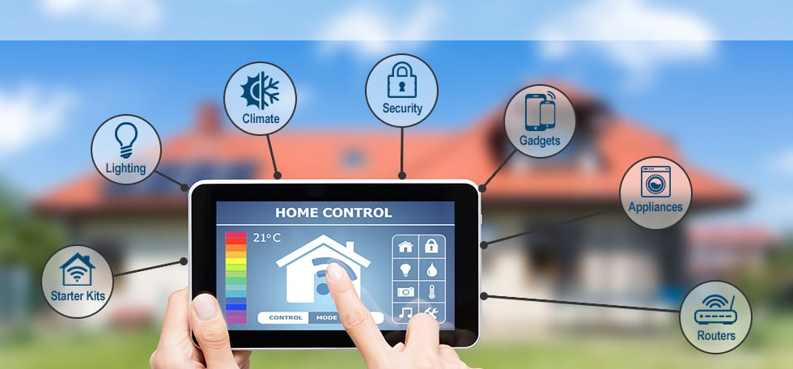
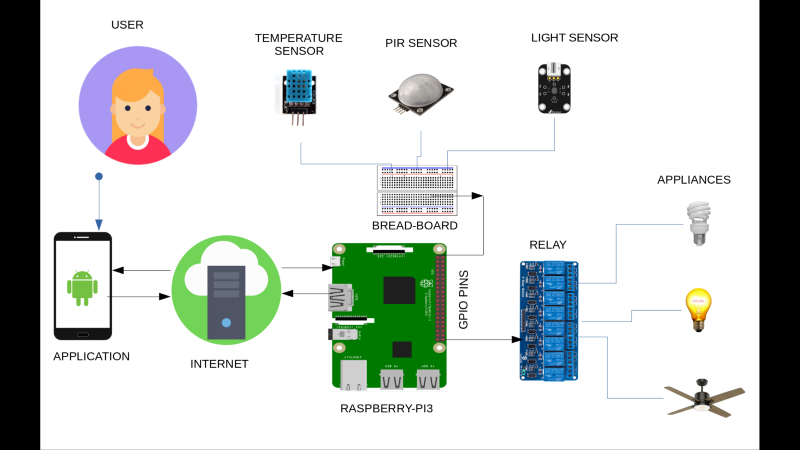

Home automation system will control lighting, climate, entertainment systems, and appliances. It may also include home security such as access control and alarm systems. Moreover we have placed sensors like temperature , light and PIR to record conditions of surroundings and can take decision based on that data, automatically. 

We can control home appliances via phone from anywhere in the world or let it get controlled automatically. 

## Architecture

