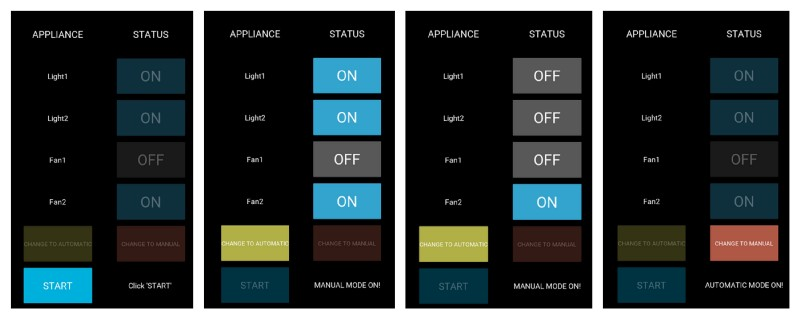

# INTERNEt Of THINGs : Raspberry Pi Home automation System based on IoT


Home automation system will control home appliances in manual and automatic mode as per user choice. It may also include home security such as access control and alarm systems. What we have done is we have placed sensors like temperature, light and PIR to record conditions of surroundings. Algorithm can take decision based on that data, optimally in automatic mode without user interaction. User will always get to know the status of home appliances. 

We can control home appliances via phone from anywhere in the world or let it get controlled automatically. 

## Architecture


This Project can be divided into 3 modules as shown :

* End User(Phone)
* Raspberry Pi End (Home appliances)
* Server/Cloud (via which both part can communicate)

## User End

The interface for user end is made using python's kivy framework. User can control appliances manually using the mobile/desktop application in manual mode or can let them get controlled automatically in automatic mode.

Some glimpses of our user end :



[main.kv](https://github.com/dolphin1999/IOT-based-Smart-Room-/blob/master/main.kv), [main.py](https://github.com/dolphin1999/IOT-based-Smart-Room-/blob/master/main.py) and also the client_secret.json file that you will get while setting up your server with Google Spreadsheets API are the required at user end.

### Installation
```sh
python -m pip install --upgrade pip wheel setuptools
python -m pip install docutils pygments pypiwin32 kivy.deps.sdl2 kivy.deps.glew
python -m pip install kivy.deps.gstreamer
python -m pip install kivy
pip install pygame
pip install oauth2client
pip install gspread
```

## RaspberryPi End

This module contains the code for fetching data from server and changing state of appliances accordingly. In automatic mode it will utilise the output of sensors to control state of devices.

[Raspend.py](https://github.com/dolphin1999/IOT-based-Smart-Room-/blob/master/Raspend.py) is required at RaspberryPi end.

### Connections


### Installation
```sh
pip install oauth2client
pip install gspread
git clone https://github.com/szazo/DHT11_Python.git
```
go inside DHT11_Python and copy dht11.py and __init__.py inside your project folder.

## Google Spreadsheet setup(Server)

For communication between mobile application and Raspberry Pi via internet there should be a server, here we have used Google Cloud as our database server.

The following steps are required to be followed to setup the database server :-
1) Go to the Google APIs Console.
2) Create a new project.
3) Click Enable API. Search for and enable the Google Drive API.
4) Create credentials for a Web Server to access Application Data.
5) Name the service account and grant it a Project Role of Editor.
6) Download the JSON file.
7) Copy the JSON file to the code directory and rename it to client_secret.json.
8) Find the  client_email inside client_secret.json. Back in spreadsheet, click the Share button in the top right, and paste the client email into the People field to give it edit rights. Hit Send.

For each and every minute detail refer to the [blog]()

### Some glimpses of working project :
[Watch the video here](https://drive.google.com/open?id=1WMpAnpgXQCUSIfwDlJ74kY0ysotc0RO4)


